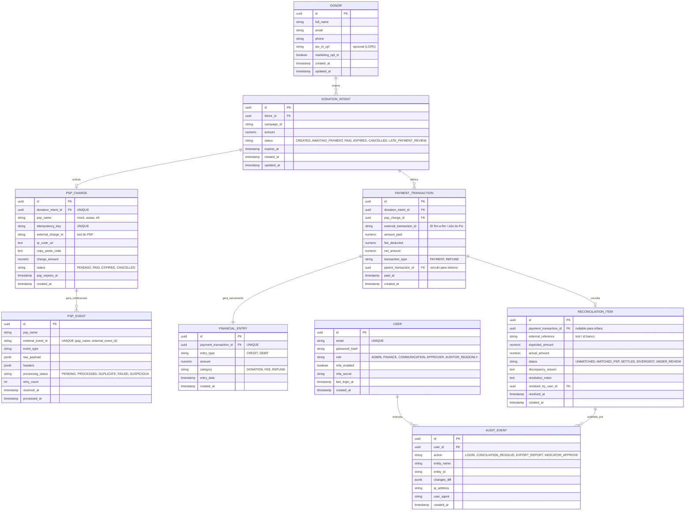
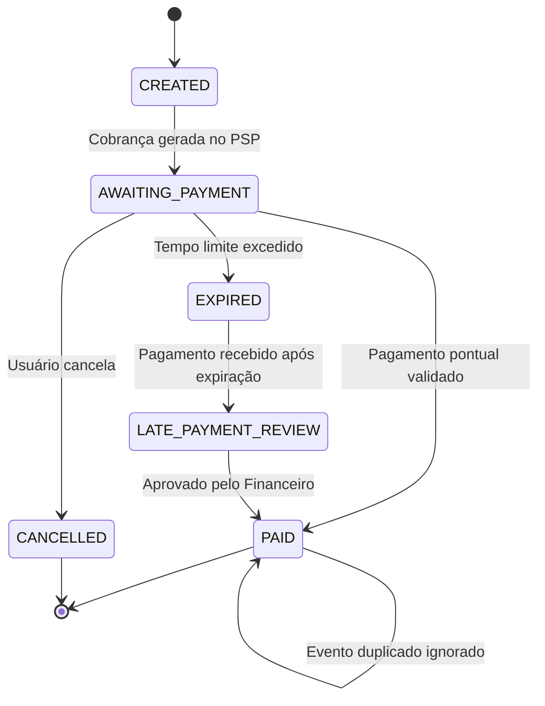

# Data Model: Ebenézer Recorrente

**Feature Branch**: `001-ebenezer-recorrente`  
**Date**: 2026-10-01  
**Spec**: [spec.md](./spec.md) | **Research**: [research.md](./research.md)

## 1. Diagrama de Relacionamento de Entidades

## 2. Tabelas e Definições de Atributos

### 2.1 `donors`
- `id` (UUID, Primary Key, Default `gen_random_uuid()`)
- `full_name` (VARCHAR(255), Not Null)
- `email` (VARCHAR(255), Not Null, Index)
- `phone` (VARCHAR(30), Nullable)
- `tax_id_cpf` (VARCHAR(14), Nullable, Encrypted/Masked no banco e logs) - Coletado apenas se o doador solicitar recibo nominal.
- `marketing_opt_in` (BOOLEAN, Default `false`) - Consentimento explícito e desmarcado por padrão (LGPD).
- `created_at` (TIMESTAMPTZ, Default `NOW()`)
- `updated_at` (TIMESTAMPTZ, Default `NOW()`)

### 2.2 `donation_intents`
- `id` (UUID, Primary Key)
- `donor_id` (UUID, Not Null, FK -> `donors.id`)
- `campaign_id` (VARCHAR(100), Not Null)
- `amount` (NUMERIC(12,2), Not Null, Check `amount > 0`)
- `status` (VARCHAR(30), Not Null, Default `'CREATED'`)
  - Enums permitidos: `CREATED`, `AWAITING_PAYMENT`, `PAID`, `EXPIRED`, `CANCELLED`, `LATE_PAYMENT_REVIEW`.
- `expires_at` (TIMESTAMPTZ, Not Null)
- `created_at` (TIMESTAMPTZ, Default `NOW()`)
- `updated_at` (TIMESTAMPTZ, Default `NOW()`)

### 2.3 `psp_charges`
- `id` (UUID, Primary Key)
- `donation_intent_id` (UUID, Not Null, Unique, FK -> `donation_intents.id`)
- `psp_name` (VARCHAR(50), Not Null)
- `idempotency_key` (VARCHAR(100), Not Null, Unique)
- `external_charge_id` (VARCHAR(100), Not Null, Index) - ID/txid retornado pelo PSP.
- `qr_code_url` (TEXT, Nullable)
- `copy_paste_code` (TEXT, Not Null) - Linha EMV / Pix Copia e Cola.
- `charge_amount` (NUMERIC(12,2), Not Null)
- `status` (VARCHAR(30), Not Null, Default `'PENDING'`)
- `psp_expires_at` (TIMESTAMPTZ, Not Null)
- `created_at` (TIMESTAMPTZ, Default `NOW()`)

### 2.4 `psp_events`
- `id` (UUID, Primary Key)
- `psp_name` (VARCHAR(50), Not Null)
- `external_event_id` (VARCHAR(150), Not Null)
- `event_type` (VARCHAR(80), Not Null)
- `raw_payload` (JSONB, Not Null)
- `headers` (JSONB, Not Null)
- `processing_status` (VARCHAR(30), Not Null, Default `'PENDING'`)
  - Enums permitidos: `PENDING`, `PROCESSED`, `DUPLICATE`, `FAILED`, `SUSPICIOUS`.
- `retry_count` (INTEGER, Default 0)
- `received_at` (TIMESTAMPTZ, Default `NOW()`)
- `processed_at` (TIMESTAMPTZ, Nullable)
- *Índice Único*: `(psp_name, external_event_id)` - Garante idempotência de gravação física.

### 2.5 `payment_transactions`
- `id` (UUID, Primary Key)
- `donation_intent_id` (UUID, Not Null, FK -> `donation_intents.id`)
- `psp_charge_id` (UUID, Not Null, FK -> `psp_charges.id`)
- `external_transaction_id` (VARCHAR(150), Not Null) - Identificador fim-a-fim bancário.
- `amount_paid` (NUMERIC(12,2), Not Null)
- `fee_deducted` (NUMERIC(12,2), Default 0.00)
- `net_amount` (NUMERIC(12,2), Not Null)
- `transaction_type` (VARCHAR(20), Not Null) - `'PAYMENT'` ou `'REFUND'`.
- `parent_transaction_id` (UUID, Nullable, FK -> `payment_transactions.id`) - Preenchido em caso de estorno/devolução.
- `paid_at` (TIMESTAMPTZ, Not Null)
- `created_at` (TIMESTAMPTZ, Default `NOW()`)
- *Índice Único*: `(psp_charge_id, external_transaction_id, transaction_type)`

### 2.6 `financial_entries`
- `id` (UUID, Primary Key)
- `payment_transaction_id` (UUID, Not Null, Unique, FK -> `payment_transactions.id`)
- `entry_type` (VARCHAR(10), Not Null) - `'CREDIT'` ou `'DEBIT'`.
- `amount` (NUMERIC(12,2), Not Null)
- `category` (VARCHAR(50), Not Null) - `'DONATION'`, `'FEE'`, `'REFUND'`.
- `entry_date` (DATE, Not Null)
- `created_at` (TIMESTAMPTZ, Default `NOW()`)

### 2.7 `reconciliation_items`
- `id` (UUID, Primary Key)
- `payment_transaction_id` (UUID, Nullable, FK -> `payment_transactions.id`)
- `external_reference` (VARCHAR(150), Not Null, Index)
- `expected_amount` (NUMERIC(12,2), Not Null)
- `actual_amount` (NUMERIC(12,2), Not Null)
- `status` (VARCHAR(30), Not Null, Default `'UNMATCHED'`)
  - Enums permitidos: `UNMATCHED`, `MATCHED_PSP`, `SETTLED`, `DIVERGENT`, `UNDER_REVIEW`.
- `discrepancy_reason` (TEXT, Nullable)
- `resolution_notes` (TEXT, Nullable)
- `resolved_by_user_id` (UUID, Nullable, FK -> `users.id`)
- `resolved_at` (TIMESTAMPTZ, Nullable)
- `created_at` (TIMESTAMPTZ, Default `NOW()`)

### 2.8 `audit_events`
- `id` (UUID, Primary Key)
- `user_id` (UUID, Nullable, FK -> `users.id`)
- `action` (VARCHAR(80), Not Null)
- `entity_name` (VARCHAR(80), Not Null)
- `entity_id` (VARCHAR(100), Not Null)
- `changes_diff` (JSONB, Nullable)
- `ip_address` (VARCHAR(45), Not Null)
- `user_agent` (VARCHAR(255), Nullable)
- `created_at` (TIMESTAMPTZ, Default `NOW()`)

## 3. Máquina de Estados e Regras de Transição

### Transições de `DonationIntent`

### Regras de Imutabilidade Financeira
1. Lançamentos em `payment_transactions` e `financial_entries` são append-only (somente inserção).
2. Estornos criam uma nova transação com `transaction_type = 'REFUND'` e `amount_paid < 0`, mantendo a transação original intacta.
3. Não é permitido deletar ou modificar valores numéricos já liquidados.
