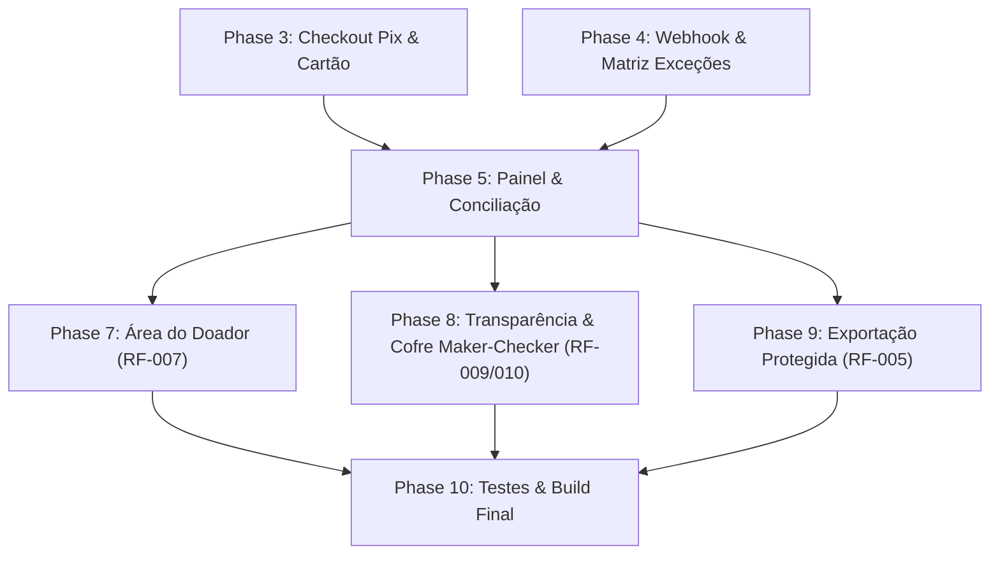

# Implementation Tasks: Ebenézer Recorrente (MVP 1)

**Feature Branch**: `001-ebenezer-recorrente`  
**Date**: 2026-10-01  
**Spec**: [spec.md](./spec.md) | **Plan**: [plan.md](./plan.md) | **Data Model**: [data-model.md](./data-model.md)

## Phase 1: Setup (Shared Infrastructure)

**Purpose**: Inicialização do repositório, configuração dos projetos backend e frontend com TypeScript e ferramentas de qualidade.

- [x] T001 Inicializar estrutura de pastas `backend/` e `frontend/` conforme o plano de implementação
- [x] T002 Inicializar `backend/package.json` com TypeScript, Fastify, Zod, Vitest e scripts de execução
- [x] T003 [P] Inicializar `frontend/package.json` com React 18, Vite, TypeScript, Tailwind CSS e Lucide Icons
- [x] T004 [P] Configurar variáveis de ambiente e validador de configuração com Zod em `backend/src/config/env.ts`
- [x] T005 [P] Configurar cliente de banco de dados e migrações SQL em `backend/src/infra/database/client.ts`

---

## Phase 2: Foundational (Blocking Prerequisites)

**Purpose**: Infraestrutura central de dados, entidades imutáveis, controle de erros e máquina de estados pura.

**CRITICAL**: Nenhuma User Story pode ser concluída sem a máquina de estados e o esquema de banco estabelecidos.

- [x] T006 Criar esquemas DDL e migrações SQL para todas as tabelas (`donors`, `donation_intents`, `psp_charges`, `psp_events`, `payment_transactions`, `financial_entries`, `reconciliation_items`, `users`, `audit_events`) em `backend/src/infra/database/schema.sql`
- [x] T007 [P] Implementar entidades de domínio puras (`Donor`, `DonationIntent`, `PspCharge`, `PaymentTransaction`, `ReconciliationItem`) em `backend/src/domain/entities/`
- [x] T008 [P] Implementar a Máquina de Estados Financeira pura com transições unidirecionais e regras de imutabilidade em `backend/src/domain/state-machine/financial-state-machine.ts`
- [x] T009 [P] Implementar middleware centralizado de tratamento de erros, logging estruturado (sem vazamento de dados sensíveis ou CPF) em `backend/src/infra/http/middlewares/error-handler.ts`
- [x] T010 Implementar servidor HTTP Fastify base com suporte a CORS, JSON e rotas versionadas em `backend/src/infra/http/server.ts`

**Checkpoint**: Fundação pronta - entidades e infraestrutura prontas para implementação das User Stories.

---

## Phase 3: User Story 1 - Doação Pontual via Pix com Confirmação Imediata (Priority: P1)

**Goal**: Permitir que um doador acerte uma doação na interface pública, receba QR Code e código Copia e Cola dinâmicos válidos e veja a confirmação visual na tela após pagar.

**Independent Test**: Executar requisição POST em `/api/v1/donations/checkout` com dados de teste, verificar geração da cobrança com expiração e consultar `/api/v1/donations/:id/status` até confirmação.

### Tests for User Story 1
- [x] T011 [P] [US1] Teste unitário da criação de intenção de doação e validações de CPF opcional e LGPD em `backend/tests/unit/donation-intent.test.ts`
- [x] T012 [P] [US1] Teste de integração da rota de checkout de doação `/api/v1/donations/checkout` e polling de status em `backend/tests/integration/checkout.test.ts`

### Implementation for User Story 1
- [x] T013 [P] [US1] Implementar serviço de listagem de campanhas ativas em `backend/src/modules/donations/campaigns-service.ts`
- [x] T014 [US1] Implementar caso de uso `CreateDonationCheckoutUseCase` com criação de `Donor`, `DonationIntent` e chamada ao gateway PSP em `backend/src/modules/donations/create-checkout.usecase.ts`
- [x] T015 [US1] Implementar caso de uso `GetDonationStatusUseCase` para consulta de status pelo frontend em `backend/src/modules/donations/get-status.usecase.ts`
- [x] T016 [US1] Implementar controladores e rotas HTTP de doações (`/api/v1/campaigns`, `/api/v1/donations/checkout`, `/api/v1/donations/:id/status`) em `backend/src/modules/donations/donations.controller.ts`
- [x] T017 [P] [US1] Implementar página e formulário de checkout responsivo (seleção de valores, dados mínimos, opt-in LGPD desmarcado por padrão) em `frontend/src/modules/checkout/DonationForm.tsx`
- [x] T018 [US1] Implementar componente de exibição do Pix (QR Code, linha Copia e Cola, contador regressivo de expiração e polling de verificação) em `frontend/src/modules/checkout/PixPaymentScreen.tsx`
- [x] T019 [US1] Implementar tela de sucesso com agradecimento e mensagem de confirmação em `frontend/src/modules/checkout/DonationSuccessScreen.tsx`

**Checkpoint**: User Story 1 completa e testável de ponta a ponta na interface pública.

---

## Phase 4: User Story 2 - Recepção Confiável de Webhooks e Matriz de Exceções (Priority: P1)

**Goal**: Ingestão resiliente e persistente de webhooks do PSP, prevenção total de transações duplicadas, reconciliação idempotente e cobertura da matriz de exceções financeiras.

**Independent Test**: Executar a suíte de testes da Matriz de Exceções simulando webhook duplicado, webhook adulterado, intenção expirada e valor divergente, validando a integridade contábil.

### Tests for User Story 2
- [x] T020 [P] [US2] Teste automatizado de validação de assinatura e idempotência de gravação de webhooks em `backend/tests/financial-matrix/webhook-idempotency.test.ts`
- [x] T021 [P] [US2] Teste da Matriz de Exceções Financeiras (pagamentos tardios `LATE_PAYMENT_REVIEW`, valores divergentes `DIVERGENT`, estornos compensatórios) em `backend/tests/financial-matrix/exceptions-matrix.test.ts`

### Implementation for User Story 2
- [x] T022 [P] [US2] Implementar interface `PspGatewayAdapter` e contrato normalizado de eventos em `backend/src/modules/psp/psp-adapter.interface.ts`
- [x] T023 [P] [US2] Implementar simulador nativo `MockPspAdapter` com controle programável de eventos e atrasos em `backend/src/modules/psp/adapters/mock-psp.adapter.ts`
- [x] T024 [P] [US2] Implementar adaptador para o Asaas (`AsaasPspAdapter`) em `backend/src/modules/psp/adapters/asaas-psp.adapter.ts`
- [x] T025 [US2] Implementar serviço de ingestão durável de webhooks (gravação atômica em `PspEvent` antes de HTTP 2xx) em `backend/src/modules/psp/webhook-ingestion.service.ts`
- [x] T026 [US2] Implementar processador de eventos financeiro com regras de idempotência, atualização da intenção e criação de `PaymentTransaction` e `FinancialEntry` em `backend/src/modules/psp/event-processor.service.ts`
- [x] T027 [US2] Implementar tratamento de exceções contábeis (pagamentos tardios pós-expiração, divergência de valor e quarentena) em `backend/src/modules/reconciliation/exceptions-handler.ts`
- [x] T028 [US2] Implementar serviço idempotente de despacho de comprovante transacional por e-mail em `backend/src/modules/notifications/receipt-email.service.ts`
- [x] T029 [US2] Configurar rotas de webhook `/api/v1/webhooks/psp/:pspName` com verificação segura em `backend/src/modules/psp/webhooks.controller.ts`

**Checkpoint**: User Stories 1 e 2 integradas, cobrindo o fluxo completo de pagamento dinâmico e tratamento de exceções.

---

## Phase 5: User Story 3 - Painel Financeiro, Caixa de Exceções e Conciliação (Priority: P2)

**Goal**: Permitir que a equipe financeira visualize métricas em tempo real (separando intenções de valores liquidados), trate a Caixa de Exceções e registre conciliações com auditoria.

**Independent Test**: Autenticar no back-office com papel `FINANCE`, consultar o resumo do painel, selecionar um pagamento tardio na Caixa de Exceções e aprová-lo com justificativa, verificando o registro gerado em `audit_events`.

### Tests for User Story 3
- [x] T030 [P] [US3] Teste de autorização RBAC e bloqueio de perfis sem permissão em `backend/tests/unit/rbac-guard.test.ts`
- [x] T031 [P] [US3] Teste de resolução manual de exceção financeira e geração imutável de trilha de auditoria em `backend/tests/integration/reconciliation.test.ts`

### Implementation for User Story 3
- [x] T032 [P] [US3] Implementar autenticação administrativa, geração de JWT e validação de MFA em `backend/src/modules/backoffice/auth.service.ts`
- [x] T033 [P] [US3] Implementar guardas de controle de acesso por papel (RBAC: `ADMIN`, `FINANCE`, `COMMUNICATION`, etc.) em `backend/src/infra/http/middlewares/rbac-guard.ts`
- [x] T034 [US3] Implementar serviço de métricas financeiras segregadas (intenções vs confirmadas vs liquidadas vs divergentes) em `backend/src/modules/backoffice/dashboard.service.ts`
- [x] T035 [US3] Implementar serviço de listagem e resolução de itens da Caixa de Exceções com justificativa obrigatória em `backend/src/modules/reconciliation/reconciliation.service.ts`
- [x] T036 [US3] Implementar serviço de registro e consulta de trilha de auditoria imutável em `backend/src/modules/backoffice/audit.service.ts`
- [x] T037 [US3] Implementar rotas e controladores do back-office (`/api/v1/admin/*`) em `backend/src/modules/backoffice/backoffice.controller.ts`
- [x] T038 [P] [US3] Implementar tela de login e verificação MFA no frontend em `frontend/src/modules/backoffice/LoginPage.tsx`
- [x] T039 [US3] Implementar tela de Dashboard Financeiro com métricas segregadas e cards de alerta em `frontend/src/modules/backoffice/DashboardPage.tsx`
- [x] T040 [US3] Implementar tela da Caixa de Exceções com modal de resolução justificada e trilha de auditoria em `frontend/src/modules/backoffice/ExceptionsPage.tsx`

**Checkpoint**: Back-office funcional, seguro e auditável, permitindo o fechamento e a conciliação financeira assistida.

---

## Phase 6: Polish & Cross-Cutting Concerns

**Purpose**: Verificações finais de segurança, testes ponta a ponta e simulação executável.

- [x] T041 [P] Criar script executável de simulação completa (checkout -> webhook -> polling -> conciliação) em `backend/scripts/simulate-flow.ts`
- [x] T042 [P] Validar mascaramento de dados sensíveis (CPF, chaves de webhook, senhas) em todos os logs e respostas de erro
- [x] T043 [P] Validar critérios de acessibilidade WCAG 2.1 AA e responsividade mobile no checkout de doação
- [x] T044 Executar a suíte completa de testes (`npm test`) e atualizar relatório de homologação de acordo com a seção 0 do PRD

---

---

## Phase 7: Área do Doador & Gestão de Consentimento LGPD (RF-007, RF-008)

**Goal**: Permitir que doadores autentiquem com OTP/Magic Link, consultem histórico, gerenciem assinaturas recorrentes e exerçam direitos LGPD.

- [x] T045 [P] Implementar serviço de autenticação por OTP (`DonorAuthService`) e geração de tokens temporários em `backend/src/modules/donors/donor-auth.service.ts`
- [x] T046 [P] Implementar serviço do portal do doador (`DonorPortalService`) com listagem de doações, cancelamento de assinaturas e direitos LGPD em `backend/src/modules/donors/donor-portal.service.ts`
- [x] T047 Implementar rotas e controlador `/api/v1/donor/*` em `backend/src/modules/donors/donor-portal.controller.ts`
- [x] T048 [P] Implementar módulo do portal do doador no frontend (`DonorPortalPage.tsx`) com autenticação OTP, histórico e cancelamento de recorrência

---

## Phase 8: Transparência Pública & Cofre de Números Maker-Checker (RF-009, RF-010, DECISÃO-07)

**Goal**: Gestão estruturada de indicadores e evidências privadas, aprovação editorial Maker-Checker (o criador não pode aprovar seu próprio indicador) e página pública agregada de impacto sem exposição de beneficiários.

- [x] T049 [P] Implementar serviço de indicadores e regra Maker-Checker (`IndicatorsService`) em `backend/src/modules/transparency/indicators.service.ts`
- [x] T050 Implementar rotas de transparência pública (`/api/v1/transparency/indicators`) e gestão administrativa (`/api/v1/admin/indicators/*`) em `backend/src/modules/transparency/transparency.controller.ts`
- [x] T051 [P] Implementar página pública de transparência no frontend (`TransparencyPage.tsx`)
- [x] T052 [P] Implementar gestão do Cofre de Indicadores no back-office com abas de submissão e aprovação Maker-Checker (`IndicatorsVaultPage.tsx`)

---

## Phase 9: Exportação Protegida de Relatórios e Auditoria (RF-005)

**Goal**: Permitir exportação de conciliação e relatórios financeiros com registro imutável em `audit_events`.

- [x] T053 [P] Implementar rota `/api/v1/admin/reports/export` com segregação de dados contábeis e registro de auditoria em `backend/src/modules/backoffice/backoffice.controller.ts`
- [x] T054 [P] Adicionar ação de exportação de conciliação com 1 clique no frontend (`DashboardPage.tsx` e `ExceptionsPage.tsx`)

---

## Phase 10: Testes Automatizados & Validação da Suíte

- [x] T055 [P] Criar testes de autenticação OTP, isolamento de dados do doador e cancelamento de assinatura em `backend/tests/unit/donor-portal.test.ts`
- [x] T056 [P] Criar testes da regra Maker-Checker e privacidade de indicadores em `backend/tests/unit/transparency-vault.test.ts`
- [x] T057 [P] Criar testes de exportação protegida com auditoria em `backend/tests/unit/financial-export.test.ts`
- [x] T058 Executar suíte completa (`npm test` e `npm run build`) e atualizar artefatos interativos

---

## Dependencies & Execution Order

